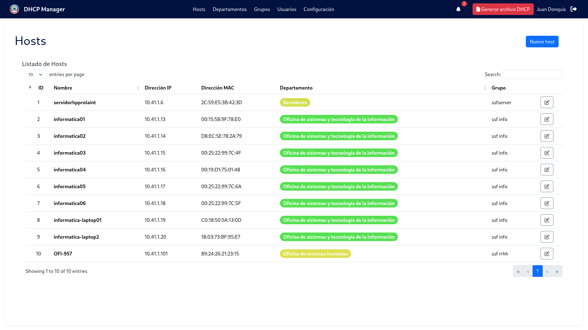

# DHCP Manager

Desktop application for DHCP file management (Laravel + NativePHP)

## Installation

Use the dependency manager [Composer](https://getcomposer.org/) to install Laravel and Native PHP.

```bash
git clone https://github.com/JDonquis/dhcp-manager.git
```

```bash
composer install
npm install
```
```bash
cp .env.example .env
```
Set values of MySQL database and then:

```bash
php artisan migrate --seed
```

```bash
php artisan native:serve
```


## **Tools**  
- Laravel 10  
- NativePHP  
- Bootstrap 5 


  

## **Get in touch**  
[juandonquis07@gmail.com](mailto:tu@email.com)  

## License

Copyright (c) Secretaria de Salud. All rights reserved.